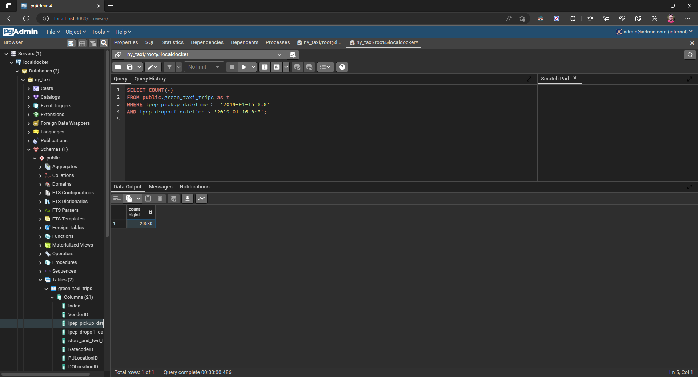
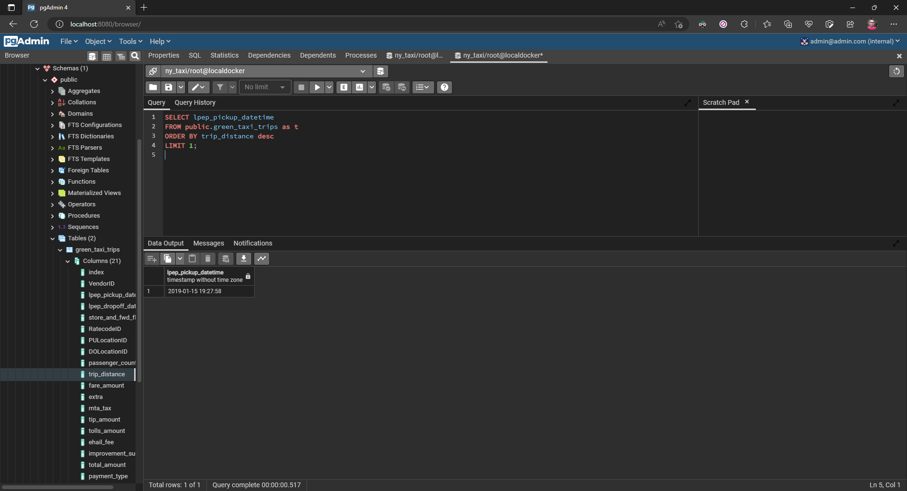
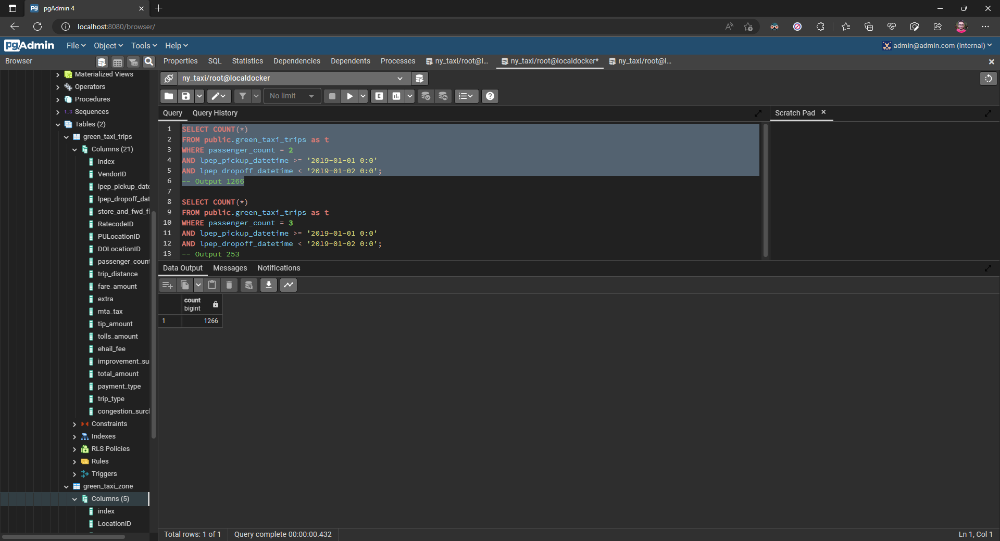
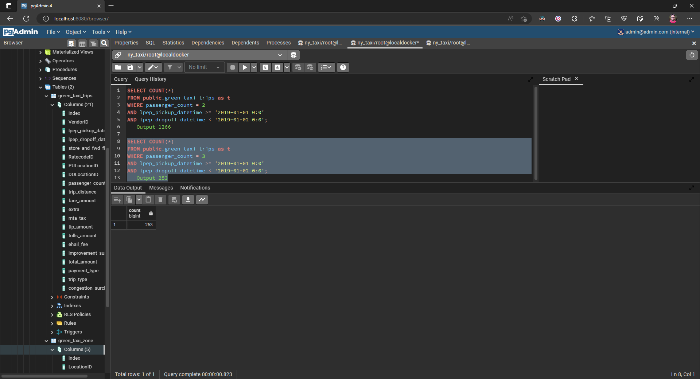
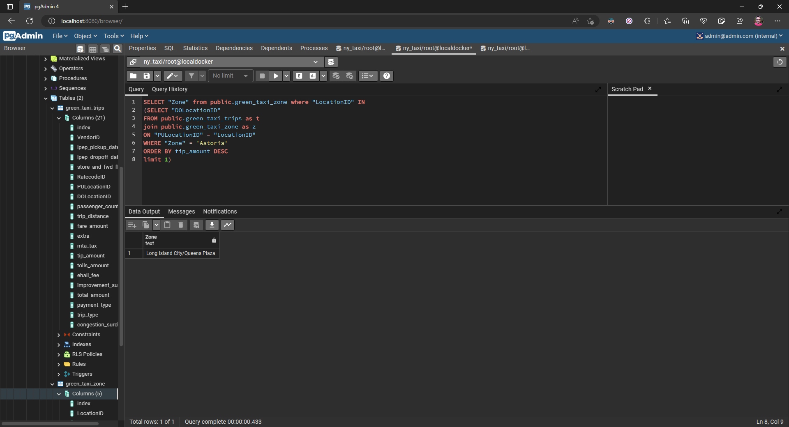

## Week 1 Homework

In this homework we'll prepare the environment and practice with Docker and SQL


## Question 1. Knowing docker tags

Run the command to get information on Docker 

```docker --help```

Now run the command to get help on the "docker build" command

Which tag has the following text? - *Write the image ID to the file* 

- `--imageid string`
- `--iidfile string` - __Answer__
- `--idimage string`
- `--idfile string`

```bash
$ docker build --help

Usage:  docker build [OPTIONS] PATH | URL | -

Build an image from a Dockerfile

Options:
      --add-host list           Add a custom host-to-IP mapping (host:ip)
      --build-arg list          Set build-time variables
      --cache-from strings      Images to consider as cache sources
      --disable-content-trust   Skip image verification (default true)
  -f, --file string             Name of the Dockerfile (Default is 'PATH/Dockerfile')
      --iidfile string          Write the image ID to the file
```
## Question 2. Understanding docker first run 

Run docker with the python:3.9 image in an interactive mode and the entrypoint of bash.
Now check the python modules that are installed ( use pip list). 
How many python packages/modules are installed?

- 1
- 6
- 3 - __Answer__
- 7

```bash
$ docker run -ti python:3.9 /bin/bash
root@ea3729abbd35:/# pip list
Package    Version
---------- -------
pip        22.0.4
setuptools 58.1.0
wheel      0.38.4
WARNING: You are using pip version 22.0.4; however, version 22.3.1 is available.
You should consider upgrading via the '/usr/local/bin/python -m pip install --upgrade pip' command.
```

# Prepare Postgres

Run Postgres and load data as shown in the videos
We'll use the green taxi trips from January 2019:

```wget https://github.com/DataTalksClub/nyc-tlc-data/releases/download/green/green_tripdata_2019-01.csv.gz```

You will also need the dataset with zones:

```wget https://s3.amazonaws.com/nyc-tlc/misc/taxi+_zone_lookup.csv```

Download this data and put it into Postgres (with jupyter notebooks or with a pipeline)

```docker
docker run --network=back-end taxi_ingest:v02 --user=root --password=root --host=postgresdb --port=5432 --db=ny_taxi --table_name=green_taxi_trips --url="https://github.com/DataTalksClub/nyc-tlc-data/releases/download/green/green_tripdata_2019-01.csv.gz"

docker run --network=back-end taxi_ingest:v03 --user=root --password=root --host=postgresdb --port=5432 --db=ny_taxi --table_name=green_taxi_zone --url="https://s3.amazonaws.com/nyc-tlc/misc/taxi+_zone_lookup.csv"
```

## Question 3. Count records 

How many taxi trips were totally made on January 15?

Tip: started and finished on 2019-01-15. 

Remember that `lpep_pickup_datetime` and `lpep_dropoff_datetime` columns are in the format timestamp (date and hour+min+sec) and not in date.

- 20689
- 20530 - __Answer__
- 17630
- 21090

```sql
SELECT COUNT(*)
FROM public.green_taxi_trips as t
WHERE lpep_pickup_datetime >= '2019-01-15 0:0'
AND lpep_dropoff_datetime < '2019-01-16 0:0';
```


## Question 4. Largest trip for each day

Which was the day with the largest trip distance Use the pick up time for your calculations.

- 2019-01-18
- 2019-01-28
- 2019-01-15 - __Answer__
- 2019-01-10
```sql
SELECT lpep_pickup_datetime
FROM public.green_taxi_trips as t
ORDER BY trip_distance desc
LIMIT 1;
```

## Question 5. The number of passengers

In 2019-01-01 how many trips had 2 and 3 passengers?
 
- 2: 1282 ; 3: 266
- 2: 1532 ; 3: 126
- 2: 1282 ; 3: 254 - __Answer__ *Approx*
- 2: 1282 ; 3: 274
```sql
SELECT COUNT(*)
FROM public.green_taxi_trips as t
WHERE passenger_count = 2 
AND lpep_pickup_datetime >= '2019-01-01 0:0'
AND lpep_dropoff_datetime < '2019-01-02 0:0';
-- Output 1266

SELECT COUNT(*)
FROM public.green_taxi_trips as t
WHERE passenger_count = 3
AND lpep_pickup_datetime >= '2019-01-01 0:0'
AND lpep_dropoff_datetime < '2019-01-02 0:0';
-- Output 253
```



## Question 6. Largest tip

For the passengers picked up in the Astoria Zone which was the drop off zone that had the largest tip?
We want the name of the zone, not the id.

Note: it's not a typo, it's `tip` , not `trip`

- Central Park
- Jamaica
- South Ozone Park
- Long Island City/Queens Plaza - __Answer__

```sql
SELECT "Zone" from public.green_taxi_zone where "LocationID" IN
(SELECT "DOLocationID"
FROM public.green_taxi_trips as t
join public.green_taxi_zone as z
ON "PULocationID" = "LocationID"
WHERE "Zone" = 'Astoria'
ORDER BY tip_amount DESC
limit 1)
```

## Submitting the solutions

* Form for submitting: [form](https://forms.gle/EjphSkR1b3nsdojv7)
* You can submit your homework multiple times. In this case, only the last submission will be used. 

Deadline: 26 January (Thursday), 22:00 CET


## Solution

We will publish the solution here